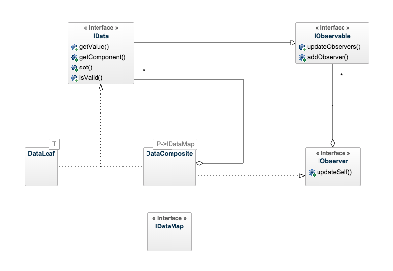

# composite-data
[](https://badge.fury.io/js/composite-data)
[](https://www.npmjs.com/package/composite-data)
[](https://travis-ci.org/Metroxe/composite-data)
[](https://github.com/Metroxe/composite-data/issues)
[](https://github.com/Metroxe/composite-data/stargazers)

composite-data is a library that stores data in a composite pattern to be used for cross project validation. Implement a front-end application and a server-side application and be able to use the exact same validation processes in both. The library also allows data to be grouped into object to allow for collections of data to be validated simultaneously. Use this library with data storage and singleton's to create robust form components or use it client side to create comprehensive models that are guaranteed to be inflated easily with client side data and verification processes.

## Installation

### Yarn
```
yarn add composite-data
```

### npm
```
npm install composite-data --save
```

## How To Use This Library
There are two types of objects that can be instantiated, **DataLeafs and DataComposites**, as well as two interfaces, **IObserver and IObservable**. Each of these are covered below.

###DataLeaf
The DataLeaf is the purest form of information, it sits at the bottom level of the composite, and holds a single object. DataLeaf Also uses a template for the value that it contains, this type for the value is defined by `T`. Also it is important to note that each dataLeaf extends the IObservable Interface

####`getValue(): T`
This will return the current value for the data object. So if it is a string then it will return the string for the leaf. If there is no value it will return `undefined`.

####`getComponent(): DataLeaf<T>`
This will return the object itself, over very useful for iteration of multiple different dataLeaves.

####`set(value: T | any, force?: boolean): boolean | Promise<boolean>`
To change the value held by the leaf, use this method. value is the data you want to replace and the function will always return true or false based on if the value passed validation. In some cases where an api call is needed to validate or a promise/callback is involved in the validation, then a promise that returns a boolean will be returned.

####`updateObservers(): void`
This will update all observers of the current value held.

####`addObserver(observer: IObserver): void`
Adds another observer to current instance of the DataLeaf.

###DataComposite
The DataObserver is a collection of other `IData` (other `DataComposites` or `DataLeaves`) and are organized via a structure define the template variable `P` which is of type `IDataMap`

####`getValue(): object`
This will return a JSON object of all the children of this data composite. An example of Name is below

```typescript
const firstName: FirstName = new FirstName("Christopher");
const middleName: MiddleName = new MiddleName("Vinson");
const lastName: LastName = new LastName("Powroznik");
const fullNameMap: IFullNameMap = {
    firstName,
    lastName,
    middleName,
};
const fullName: FullName = new FullName(fullNameMap);
const fullNameValue: object = fullName.getValue();

console.log(fullNameValue);
```
```json
{
    "firstName": "Christopher",
    "middleName": "Vinson",
    "lastName": "Powroznik",
}
```

####`getComponent(): P`
this will return a IDataMap object specified by the template variable `P`

```typescript
const firstName: FirstName = new FirstName("Christopher");
const middleName: MiddleName = new MiddleName("Vinson");
const lastName: LastName = new LastName("Powroznik");
const fullNameMap: IFullNameMap = {
    firstName,
    lastName,
    middleName,
};
const fullName: FullName = new FullName(fullNameMap);
const fullNameComponent: IFullNameMap = fullName.getComponent();

// fullNameComponent will be deep equal fullNameMap
```

####`set(dataMap: P, force?: boolean): boolean | Promise<boolean>`
Allows a complete reset of the entire dataMap. It is not advised to use this often as it is better practice to edit each dataLeaf, but this method is more efficient if it necessary to replace every DataLeaf.
```typescript
const firstName: FirstName = new FirstName("Christopher");
const middleName: MiddleName = new MiddleName("Vinson");
const lastName: LastName = new LastName("Powroznik");
const fullNameMap: IFullNameMap = {
    firstName,
    lastName,
    middleName,
};
const fullName: FullName = new FullName();
fullName.set(fullNameMap);
```

####`isValid(value?: P): boolean | Promise<boolean>`

####`updateSelf(newValue?: any): void`

####`public updateObservers(): void`
This will update all observers of this data type of the current value held.

####`public addObserver(observer: IObserver): void`
Adds another observer to current instance of the DataComposite.

###IObserver


###IObservable

## Creating Custom Data

###Custom DataLeaf

###Custom Composite

## Extending Current Data

## Design Patterns
The library uses two designs patterns extensively, which are the [composite-pattern](https://en.wikipedia.org/wiki/Composite_pattern) and [observer-pattern](https://en.wikipedia.org/wiki/Observer_pattern). These two design patterns are critical to the development and implementation of this library. In this library these two patterns are implemented loosely to the image below.

